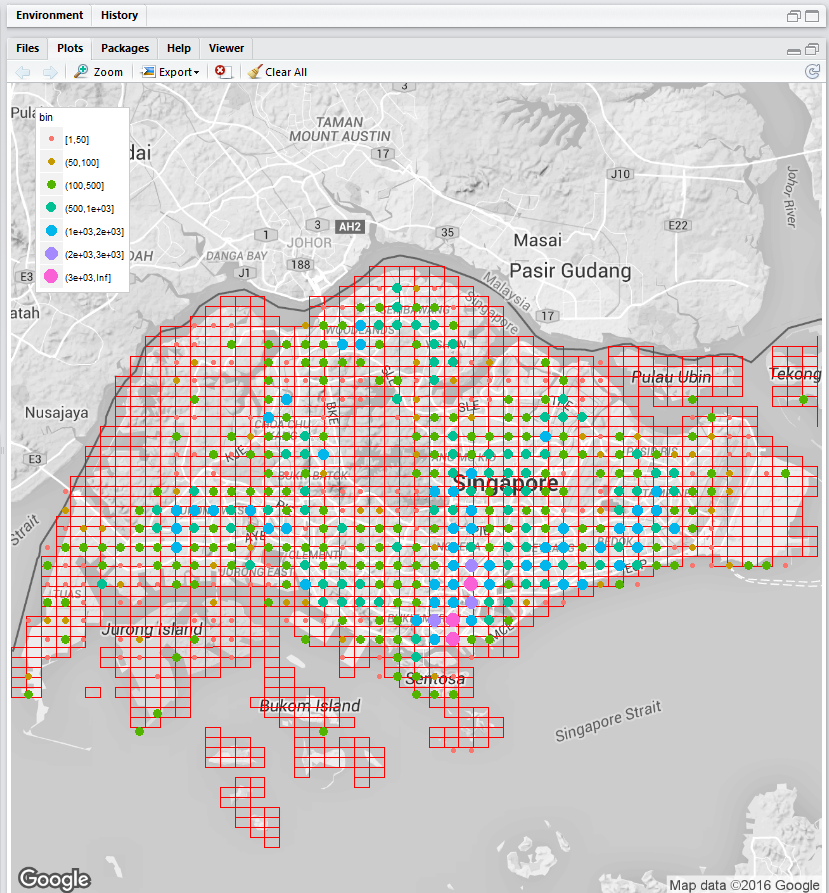

# Personal Data Protection Challenge  #

Given an anonymised individual level location dataset
over a period of time, propose a risk measurement
framework and privacy preserved method to measure
the risk of re-identification of individuals while
maintaining the utility value of the dataset.

Below is the reasoning and solution discussion for the telecom dataset provided for which privacy needs to be maintained. Hope it is useful to aspiring ones starting on location privacy. Contains detailed discussion on the approach, methodology, code snippets from PoC for the solution proposed.

[1. Exploratory Data Analysis](#_Toc445326562)

[2. Behavior Pattern and Invincibility Myth](#_Toc445326563)

[3. Privacy Preserving Methods](#_Toc445326564)

[4. Risk Assessment Framework](#_Toc445326565)

[5. Code, Analysis & Results](#_Toc445326566)

[6. References & Consideration](#_Toc445326567)

**Summary**

Data sharing is the enemy of privacy preservation. In wrong hands shared
data can lead to an individual’s identity being stolen. However in right
hands, better location based services can offer comfort and quality of
life to users.

In this PDP challenge, even though certain emphasis lay on the algorithm
and test results, given the complexity and time constraints, wherever
possible pseudo codes and solid concepts have been furnished as a strong
evidence to address the core requirements – which is to provide robust
risk/probability framework to measure re-identification risk and at the
same time enumerate best applicable privacy protection methods and
measured way to articulate trade-off between risk vs. loss in an applied
scenario. Since empirical results are short due to want of time, a solid
and robust approach anchors it for a systematic and scalable
implementation on an intelligent and mathematical foundation.

> **Team**
>
> **Nachi Nachiappan**, Founder, Managing Partner of Avantprise, has
> worked in enterprise IT industry for 15 years and possess diverse
> business domain expertise including exposure to retail & financial
> industries. Founders have to be technically capable to code & design,
> a unique proposition for new age startups that has to be nimble and
> resourceful, I embody that proposition. Data science being my passion,
> I keep dabbling on such projects and I hope this proposal is worth
> that effort to positively make some impact on data sharing in
> enterprise and public realm.

<span id="_Toc445326562" class="anchor"></span> 
### 1. Exploratory Data Analysis ###

**Data Summary:**

- Sample size: 915 people
- Overall duration: 1 to 16 Sept. 2015
- Customers: customer\_&lt;id&gt;
- Temporal resolution: variant, at most 1 record per 15 min
- Spatial co-ordinates (when boxed):
- Top Left: Minimum longitude: 103.00 Maximum latitude: 1.46
- Bottom Right: Maximum longitude: 104.05 Minimum latitude: 1.21

**Overall Location Data Frequency:**

From the given data points, location data frequency (data points per
latitude/longitude combination) was plotted to see how data is dispersed
in each location, yielded this graph by super imposing Singapore map
(courtesy google) with [SLA’s
cadastral](https://data.gov.sg/dataset/sla-cadastral-map-index) map
index.



Figure: 1

Size of the dots equates to data points available in each geo
coordinates. This signifies that majority of geo coordinates have more
than or equal to 500 data points.

**Other Metrics of Interest in Data Exploration:**

-   Customer Count vs Binned Data Point Counts

    -   this would roughly give a picture of data point density and how
        many customers fall under them
    -   Essentially Binned Data Point Count varies from 11

    |  Data Point Range (Bins)  |  Customer Count (who fall under this bin) |
    |---|---|
    |  1 – 10   |  31 |
    |  11 – 100  |  217 |
    |  101 – 1000  |  663 |
    |  &gt;1000   |  4 |

    
    Certainly the 31 are vulnerable of being identified given the low
    incidence of data points if their top locations or trajectory could be
    reverse engineered. But the likelihood of reverse engineering depends
    whether their trails in social media is identifiable to a level to
    warrant an attack (query) on this dataset.

-   Customer Unique Trajectory Identification

    For every customer, unique location track (2 point, 3 point, 4
    point, 5 point) can be analyzed over a time span of morning peak,
    afternoon, evening peak and weekends could be constructed and
    populated as follows:

    Customer count vs Unique track count (over different time periods).
    This aids in finding out how many unique trace paths are available
    per customer. This can be compared with a random path generated to
    see how much the data privacy method fared in re-identification.

-   Top N location Frequency Measure

    This measure gives a visualization of how many times locations are
    highly frequented by the sample population. A sample graph
    illustrating this is given below

    {width="4.608333333333333in"
    height="3.5416666666666665in"}

    Figure: 2

<span id="_Toc219701708" class="anchor"><span id="_Toc445326563"
    class="anchor"></span></span>
 ### 2. Behavior Pattern and Invincibility Myth ###

Study of human mobility data on various mobility datasets by
different researchers have concluded that human mobility traces are
highly unique. In fact, in a dataset where the location of an
individual is specified hourly, and with a spatial resolution equal
to that given by the carrier's antennas, four spatio-temporal points
are enough to uniquely identify 95% of the individuals.

With this background, if we could identify certain attributes of
individuals, we can always identify a unique individual in a given
dataset that leads to privacy breach. Let’s look at the data sources
and how data can be extracted that could potentially
compromise privacy.

**Individual Trajectory / Behavior Pattern Analysis**

As a basis for our analysis, given dataset contains a total of 192,689
trajectories points from 915 users. The total distance covered by all
users can be reverse computed using R ‘geosphere’ package based on
locations are expressed in longitude and latitude.

Several preprocessing steps can be considered for our analysis:

1.  As we are interested in the start and end locations and the
    durations of the trajectories, we can extract the first and last
    entry of each trajectory in the dataset;

2.  Different longitudes and latitudes can be merged into (numbered)
    locations, by comparing the distance of each new start point or end
    point with the person’s previously stored locations.

3.  Experiment with different thresholds (starting with 1.1 Km, which is
    reported precision of given data), we can chose a fairly large
    threshold of 1.5 km. As a consequence, some locations may be merged;
    and these may be ‘in the direct neighborhood’.

4.  Find the total trajectories that are roundtrips, with durations
    varying from less than one minute to over 5 hours.

5.  Rank a user with most trajectories. His data (we do not know the
    gender of user customer\_&lt;id&gt;, but we refer to the user as
    ‘his’ for convenience) consists of his total trajectories, collected
    on x distinct days.

We could carry out a daily analysis of customer’s travel. Following
gives some ways and sample graph illustrating the analysis results.
Hypothetically, let’s take the customer\_160 is following this kind
of sample trend **(pending an actual analysis, which is to
be co-developed)**: Sample Analysis Method, some illustrations and
text excerpted from “Daily and Weekly Patterns” in Human Mobility by
Eelco Herder and Patrick Siehndel.

As we are interested in daily and weekly patterns, Figure 3 shows
the fluctuation of trips during the day for each weekday. The thick
black line is the average of the five weekdays (Monday till Friday)
and the thick grey line averages the weekend days (Saturday
and Sunday). Some strong regularities can be observed. First, there
is very little traffic between about midnight and 7am. Further, on
weekdays, the morning rush hour has a strong peak at 8am; the
evening rush hour is more spread between 5pm and 9pm, between both
rush hours, traffic is moderate. During weekends, the picture looks
completely different: traffic starts between 7am and 8am and then
remains relatively stable throughout the day, with a slight increase
of traffic just before dinnertime.


Daily and Weekly Patterns in Human Mobility Figure: 3.

Daily travel activity during the week and in weekends. The
differences between weekdays and weekends can obviously be explained
by the fact that many people spend their weekdays at work; weekends
are used for shopping, family visits and other spare time activities
throughout the day. Consistencies, regularities are some attributes
to watch out during the analysis. Any rather average pattern can be
further, investigated by focusing on user with more trajectory
points as in Figure 4.

{width="6.275in" height="2.775in"}

Travel activities on weekdays of the hypothetical top users: Figure:
4

A Week in the Life of customer\_&lt;id&gt;. In this section we
further explore the daily movements of this user. We can check
whether this user is quite representative for the average user. We
do not aim to develop or evaluate prediction algorithms, but rather
aim to ‘get to know customer\_&lt;id&gt; better’. We could have
taken any other user with sufficient data - of course, this would
have led to slightly different results due to
individual differences. Figures 5 and 6 show the (hypothetical)
movements of customer\_&lt;id&gt; that started from the 5 most
visited locations. On weekdays, he typically leaves ‘location
1’ (blue) between 8am and 9am. He usually leaves ‘location 0’ (red)
at about 10pm. Further, he visits and leaves ‘location 2’ (yellow)
at several points during the week, but particularly during the
weekend, in the morning. ‘Location 13’ is visited in evening hours
during the week; in the weekends, location 13 is usually visited
during the day, in particular late afternoon.

{width="5.841666666666667in"
height="3.0083333333333333in"}

Daily travel activities of user 160 on weekdays Figure: 5

{width="6.075in" height="3.0416666666666665in"}

Daily travel activities of user 160 during the weekend Figure: 6

Without more context information, it seems likely that location 1 is
user 160’s Home. Location 0 is probably his Office - he seems to
work late and sometimes also in the weekend during evening hours.
Location 2 could be a shopping mall, and location 13 might be user
160’s (sport) club. Even though the exact purpose of these locations
is just a more or less educated guess, from the figures it becomes
clear that these are the four locations where user 160 spends most
of his time and where one could find him at a certain point of day -
during the week or during the weekend. The fifth most visited
location, ’location 26’ is visited far less often already and there
is a long tail of locations (137 in total) that are visited only a
couple of times. Another interesting aspect is how these locations -
the top 4 and the remaining locations at the tail - are related with
one another.

In order to find and visualize the locations and the trajectories
between them open source graph visualization toolkit
[Gephi](https://gephi.org/) can be used, see Figure 7. The size and
color of the nodes reflect the number of times that user 160
traveled to or from this location (large and red is very often,
small and blue is only a few times). The width and color of the
edges reflects the number of times that user 160 traveled between
two locations. The graph layout is force-directed, with the
longitude and latitude of the locations as a basis. Figure 7
provides evidence for our assumption that user 160 has location 1 as
his Home, and location 0 as his Office. Location 13 (‘Sport club’)
is often visited from home, but also from his office. Location 26,
Location 3 and various other locations are only visited when user
160 happens to be at Location 2 (‘Shopping mall’).

{width="5.241666666666666in"
height="4.308333333333334in"}

Connections between user 160’s locations - the thicker the edge, the
more often user 160 traveled between these two locations. Figure: 7

In general, it is striking that many locations are connected to only
one main location or are shared by two locations (the cluster of
small dots between Home and Office probably represents places that
user 160 typically visits on his commute). It may have occurred to
you that thus far we haven’t discussed or mentioned the real
locations at all. Indeed, the above discussion shows that many
observations on a user’s whereabouts can be interpreted without
considering the exact geographical locations. In order to check to
what extent our assumptions most likely hold, we now plot the top
five locations on a map.

For this we can use R packages ggplot2, maptools, rgdal and the
requisite geo coordinates.

```R
---plot SLA data for singapore matrices
install.packages("rgdal")
install.packages("maptools")
install.packages("rgeos")
gpclibPermit()

library(maptools)
library(rgdal)
library(ggplot2)

sing <- get_map(location="singapore")
ggmap(sing, extent = "normal")


df <- read.csv("D:/Data Mining/04-PdpChallenge/Inputs/DataPrepTelCom-latlongcount.csv")
geod <- as.data.frame(df)
str(geod)
geod$bin=cut(geod$freq, c(1,50,100,500,1000,2000,3000,Inf), include.lowest=TRUE)


theme_set(theme_bw(16))
singMap <- qmap("singapore", zoom = 11, color = "bw", legend = "topleft")

singMap +
  geom_point(aes(x = long, y = lat, colour = bin, size = bin),
             data = geod)

```

As the human temporal behavior is unique given sufficiency of time, user
whereabouts and who is the person can be predicted. Now the external
data sources can come to our aid in further easing this identification.

**Reverse GeoTag Location Addresses **

Using the SLA cadastral polygon map and triangulating the given 2
decimal precision geo coordinates to nearest SLA cadastral plot
coordinates, we can list the location of the prospective find. The
simple code is give as below and uses R package ggmap.

{width="6.141666666666667in"
height="1.7416666666666667in"}

**LinkedIn Connection**

People search API in LinkedIn provides wealth of data for a given target
person identification. They also allow distance based queries which
further simplify zeroing in the target. Below snippet from the [LinkedIn
API](https://developer-programs.linkedin.com/documents/people-search-api)
gives the power of people search:

{width="6.466666666666667in"
height="1.2666666666666666in"}

The sample output as below from LinkedIn provides every possible vector
to identify our target.

```xml
<?xml version="1.0" encoding="UTF-8" standalone="yes"?>
<people-search>
  <num-results></num-results>
  <people total="">
    <person>
      <id></id>
      <first-name></first-name>
      <last-name></last-name>
      <headline></headline>
      <location>
        <name></name>
        <country>
          <code></code>
        </country>
      </location>
      <industry></industry>
      <num-recommenders></num-recommenders>
      <connections total="" />
      <positions total="">
        <position>
          <id></id>
          <start-date>
            <year></year>
            <month></month>
          </start-date>
          <is-current></is-current>
          <company>
          </company>
        </position>
          ...
      </positions>
      <site-standard-profile-request> 
           <url></url>
      </site-standard-profile-request>
    </person>
     ...
  </people>
  <facets total="">
    <facet>
      <code></code>
      <name></name>
      <buckets total="">
        <bucket>
          <code></code>
          <name></name>
          <count></count>
          <selected></selected>
        </bucket>
          ...
      </buckets>
    </facet>
    ...
  </facets>
</people-search>

```

Using location and company info we can easily corroborate the target
person. Moreover their faceted query is also another good tool that can
be used for iterative and reductive queries to sieve out users from the
telecom geospatial dataset. Anonymization to 2 decimal places may thwart
easy identification but an intelligent brute force method certainly
provides ample opportunity to narrow down the suspects.

**Facebook/Twitter Connection**

With naïve users not setting their permission appropriately, end up
giving more info than intended on public domain and [Facebook Graph
API](https://developers.facebook.com/docs/graph-api/reference/v2.5/profile)
can come to our rescue in identifying target persons equally as powerful
as LinkedIn. Similarly if a Twitter user opted in for location sharing,
then the [Twitter Search
API](https://dev.twitter.com/rest/public/search) allows to search that
user in Geolocation range and find the user associated.

**Reverse Yellow Pages Search**

Most powerful search is to get all target individuals names from a
postal code within the 1.1 km range of our target search area. This
could potentially allow us to refine the users further with social media
APIs to locate a person’s top N or possible trajectory to carry out a
privacy attack successfully. In US, web reverse phone and cell search is
available over web and can be efficient tool to narrow people search to
a location.

<span id="_Toc445326564" class="anchor"></span>
### 3. Privacy Preserving Methods ###

**Privacy Breach**

In order to discover privacy breaches, one needs to define what
constitutes a privacy breach for a particular data set. There are
different levels of privacy. An optimal privacy model is defined as
‘Access to published data should not enable the attacker to learn
anything extra about any target victim, compared to no access, even with
the presence of attacker’s background knowledge obtained from another
sources. Some definition states a privacy model as ‘sensitive attribute
disclosure’, which occurs when the attacker or adversary learns
information about an individual’s sensitive attributes

**Privacy Preserving Methods (PPM)**

The idea of obfuscating a data set is known as anonymization. This is
performed on original data set to satisfy a specified privacy
requirement resulting in a modified data set being published. There are
five general categories for anonymization:

1. Generalization
2. Suppression
3. Anatomization
4. Permutation
5. Perturbation

Widely used approaches for 1^st^ 2 categories include k-anonymity,
l-diversity and t-closeness. 3^rd^ and 4^th^ achieve a similar task i.e.
disassociation of the relationship between QID (quasi identifier) and
sensitive attributes. Category 5 introduces some synthetic data values
in lieu of original which do not differ significantly from statistical
information computed from the original data.

**Proposed PPM for DataSpark**

We propose following obfuscation methods

1. Grid Masking (falls under category 1)
    <ol type="a">
    <li>K-means clustering</li>
    <li>K-means constrained</li>
    <li>Distance based Grid Aggregation (References SLA Cadastral Map)</li>
    </ol>
2. Voronoi Masking (falls under category 1)
3. Random Perturbation (falls under Category 5).
4. Weighted Random Perturbation (falls under Category 5).

**Grid Masking: **

From the given data, identifying the unique coordinates, we find that
the average distance between points is \~1.1 km, in line to the
precision of latitude and longitude at equator.

{width="4.36581583552056in" height="3.225in"}

Another observation is al nearest/subsequent neighbors are more or less
spaced by 1.1 km spacing due to the data provided in 2 decimal
precision. But the actual data may be different given the cell tower
spacing need not be to 2 decimal spacing and their location will be
absolute and from there getting to 2 or &gt; 2 decimal spacing is a
matter of privacy vs. data utility assessment decision.

 {width="5.194729877515311in" height="2.95in"}

 K-means clustering is simple and easily achievable and with the given
 data set, points cloistering around a grid matrix of 1.1 x 1.1, we can
 say that the number of grid aggregation points per cell to be 4 to 5
 and this will yield the k-means points to be 50 (488 unique locations
 with 4\~5 locations per grid amounts to 50 k-means clusters). This is
 also corroborated from the CrimeStat program results below.

 {width="5.669612860892388in"
 height="3.1416666666666666in"}

**K-means clustering**

 We can apply the above reasoning in R to obtain the cluster points:

 {width="5.908333333333333in"
 height="4.508333333333334in"}

 This gives you the clusters and as shown in the below map, we can also
 find the centroids and map them too.

 {width="6.466666666666667in" height="5.475in"}

 These centroids provide the masking. For all the data points, we
 replace lat/long coordinates with their centroids. Essentially this is
 akin to dividing the space as a 4.4x4.4 km physical distance matrix
 that may hold 4 to 5 geo coordinates.

**K-means constrained**

 Alternatively, we can constrain that each cluster contain certain
 number of geo-points and be as much as possible equidistant and decide
 the number clusters. This is a better way to obtain the desired
 cluster size with number of clusters apply k-means. This is clearly
 articulated here and can be adapted to DataSpark grid cloaking
 requirements.

**Distance based Grid Aggregation (References SLA Cadastral Map)**

 A more systematic approach to grid masking that is well customized is
 dividing the Singapore map into a distance based grid matrix where the
 starting point are (longitude/latitude) 136.6006/1.46 and end point
 being (104.05/1.21). An R function could be written as below to
 generate all long/lat points. (Courtesy Geo R Functions)

 ------- PSEUDOCODE --------
 ```
 startLong Starting Longitude (start x axis point)
 startLong Starting Latitude (start y axis point)
 endLong Ending Longitude (end x axis point)
 endLong Ending Latitude (end y axis point)
 downChunkDist down bearing (180 degree dead down) distance in meters
 downChunkDist right bearing (90 degree east) distance in meters
 GeoGridMatrix &lt;-
 ```
```
 function( startLong, startLat, endLong, endLat downChunkDist,
 rightChunkDist) {
 ----Iterate on vertical height ---------
    ----Iterate on horizontal length ---------
        Call function (new.lon.lat) to generate a cell
        Compute centroid using midpoint method in R geosphere
    ----------------------------------------------
 ----------------------------------------------
 }
```
 For co-ordinates falling on the grid lines, we could snap them to
 right or below depending on the cell availability.

 ------- PSEUDOCODE ENDS --------

```R
new.lon.lat <-
function (lon, lat, bearing, distance) 
{
    rad <- pi/180
    a1 <- lat * rad
    a2 <- lon * rad
    tc <- bearing * rad
    d <- distance/6378.145
    nlat <- asin(sin(a1) * cos(d) + cos(a1) * sin(d) * cos(tc))
    dlon <- atan2(sin(tc) * sin(d) * cos(a1), cos(d) - sin(a1) * 
        sin(nlat))
    nlon <- ((a2 + dlon + pi)%%(2 * pi)) - pi
    npts <- cbind(nlon/rad, nlat/rad)
    return(npts)
}

```

 With the above R function, we generate grid cells of any custom
 dimension and its centroid. Then we can replace all lat/long
 coordinates with their centroids as part of grid masking and evaluate
 the privacy and data loss values. This method can be combined with
 constrained k-means as well. Since SLA Cadastral map starts with
 900mx600m grid sizing, and can be deemed as currently implemented
 official statistical unit of aggregation, we can experiment grids with
 that initial sizing and incremented further to decide best one.

 **Voronoi Masking**

 A new form of obfuscation referred to here as Voronoi masking (VM) is
 Voronoi polygons, or Thiessen polygons, which define areas where the
 boundaries are equidistant between the surrounding points. In Voronoi
 masking, each point is snapped to the edges of the Voronoi polygons,
 making them equidistant between original point data. An advantage of
 this technique is that where the density of original points is higher,
 the points are moved a shorter distance on average, resulting in
 patterns that more closely resemble the original data set. Another
 advantage of Voronoi masking is that some points in adjacent polygons
 will be snapped to the same location, which can increase the
 k-anonymity for those points.

 In areas of sparse data points, it is expected that some points will
 be moved large distances with this method, which could disrupt
 patterns. However, if there are at least two points close to each
 other in a remote region, the points will potentially be moved a
 shorter distance. This is best suited when the coordinates are not
 equally spaced. More applicable when the coordinate precision is
 better and from there masking it will be useful to a 2 precision range
 though.

```R

df <- read.csv("D:/Data Mining/04-PdpChallenge/Inputs/DataPrepTelCom-latlongcount.csv")
geod <- as.data.frame(df)

install.packages("deldir", depend= TRUE) #Install
library(deldir)
library(ggplot2)
voronoi <- deldir(geod$lat, geod$long)

ggplot(data=geod, aes(x=geod$lat,y=geod$long)) +
  #Plot the voronoi lines
  geom_segment(
    aes(x = x1, y = y1, xend = x2, yend = y2),
    size = 2,
    data = voronoi$dirsgs,
    linetype = 1,
    color= "#FFB958") + 
  #Plot the points
  geom_point(
    fill=rgb(70,130,180,255,maxColorValue=255),
    pch=21,
    size = 4,
    color="#333333")
```

 Below is the Voronoi diagram for the 488 points given in the dataset.

 {width="5.3578291776028in"
 height="4.791666666666667in"}

 We have to implement a snapping algorithm than can snap equidistant
 points to test the hypothesis.

 **Random Perturbation**

 A third masking technique for this study is random perturbation (RP).
 Like with grid masking, this is applied uniformly with a specific
 meter distance threshold. In random perturbation, each point is
 relocated a random distance within a distance threshold and in a
 random direction

 R’s ***geoR*** package provides a simple method to achieve this:
 ```R
 jitter2d(coords, max, min = 0.2 \* max, fix.one = TRUE,
 which.fix = c("random", "first", "last"))
 ```
 Alternatively, R’s ***sdcMicro*** package can be used also with this
 method:
```R
addNoise(obj, variables = NULL, noise = 150, method = "additive", ...)
```
 **Weighted Random Perturbation**

 A fourth measure is weighted random perturbation (WRP), where the
 distance threshold varies according to the distribution of lat/long
 points in a cluster. The weighted distances are based on the radii
 generated in K-means process, or the distance to k nearest neighbors
 in the original point data set. The weights are thus local measures
 that vary from point to point. This hypothesis needs to be validated
 further. Essentially, we are saying relative noise based on the
 cluster size and distribution of points inside the cluster.

 **Temporal Perturbation**

 Random perturbation can be applied to time dimension as well and has
 to be evaluated for the PPM metrics. Alternatively, a coordinated
 trajectory k-anonymization is a viable method and needs further
 experimentation if the above methods fail to satisfy the privacy/loss
 tradeoff. A method has been mentioned in the references section to
 deal with trajectory anonymization but it’s effect in tandem with
 point coordinate perturbation needs to be studied further.

<span id="_Toc445326565" class="anchor"></span>
### 4. Risk Assessment Framework ###

Risk Assessment Framework (here afterwards interchangeably used with
privacy metrics) allows to know how private the sanitized version is.
There are two categories of privacy metrics: syntactic and semantic. The
syntactic measures consider the distribution of attribute values in the
privatized data set and are used by algorithms such as k-anonymity and
l-diversity, essentially estimating information loss (IL). In
comparison, the sematic metrics measure what an attacker may learn or
the incremental gain in knowledge caused by the privatized data set and
use distance measures such as the earth mover’s distance, KL divergence,
and JS divergence to quantify this difference in the attacker’s
knowledge. Other methods include increased privacy ratio (IPR) or
Disclosure Risk (DR), entropy and guessing anonymity.

For each of IL and DR, we propose both typical and specific methods to
create a robust framework under which Personal Data Protection can be
evaluated effectively.

**Information Loss (IL)**

IL measuers the differences between the original and the masked data, as
well as the differences between the analyses on the original data and
masked data. In general, given an analysis or statistics S for a data
set X, IL can be defined as follows:

IL (X, X’) = d(S(X), S(X’))

Where d is a function that measures the divergence between the two
analyses or statistics and X’ = masked(X). Naturally, when X’=X, S(X) =
S(X’) and IL (X, X’) to be zero. Therefore any distance function on the
outcome of S can be appropriate to measure. Naturally any pair of
functions S and d will lead to different IL measures. Averages of
several IL measures are also common. Although we have said that we don
not expect S(X) = S(X’), this is always not the case. Randomness and
local minima caused by different initializations might cause that S(X) =
S(X’). This is of great importance when computing IL because it can
cause that greater distortion on X leads to an apparent decrease of IL.

We’ll use 2 metrics to measure IL:

1. **Standard IL Loss:**

    IL Loss = X-X’,$\overline{X}$-$\overline{X'}$ ,V-V’,S-S’ and the
    mean absolute error of R-R’; the resulting average is used.

    Let X and X’ be the original and the masked data set. Let V and V’
    be the covariance matrices of X and X’, respectively; similarly, let
    R and R’ be the correlation matrices. Table 1 summarizes the
    measures proposed. In this table, p is the number of variables, n
    the number of records, and components of matrices are represented by
    the corresponding lowercase letters (e.g. xij is a component of
    matrix X). Regarding X –X’ measures, it also makes sense to compute
    those on the averages of variables rather than on all data (see the
    X - X’ row in below Table). Similarly, for V – V’ measures, it is
    also sensible to compare only the variances of the variables, i.e.
    to compare the diagonals of the covariance matrices rather than the
    whole matrices (see the S – S’ row in below Table).

    This gives a general idea of how far the original and masked are
    using standard measures of statistics. A lower value is best bet
    at IL.

    {width="5.191666666666666in"
    height="5.198635170603675in"}

2. **IL based on eigenvalues comparison:**

    This is available in ***sdcMicro*** package and can be used to
    compute IL. This measures distances between original and perturbed
    values, scaled by standard deviation using eigen method. (dUtility
    in R’s sdcMicro package ). Formally for each record i,

    {width="3.775in"
    height="0.9583333333333334in"}

    Where V is the number of attributes, M number of records, x~ij~
    denotes the value of record I for attribute j, x’~ij~ the same for
    protected version, Sj is the standard deviation of the j-th
    attribute in the original data.

    \*\* *In the given dataset, V is only 2 but M may be significant and
    still it gives some perspective to perturbed data and may not be
    outright casted away*.

**Disclosure Risk:**

1. **Distanced based record linkage:**

    The concepts of uniqueness and k-anonymity cannot be directly
    applied to continuous key variables because almost every unit in the
    dataset will be identified as unique. As a result, this approach
    will fail. A distance based approach that analyses nearest
    neighbours based on standard deviation and takes into account the
    outliers is the best. Robust mahalanobis distances (RMD) are
    estimated between observations (continuous variables) to obtain a
    robust, multivariate distance for each unit. These methods are also
    implemented and available in sdcMicro as dRisk() and dRiskRMD().

2. **Top N location Probability Box Plot Methodology:**

 For every N top locations. Say if it’s Top 2 location, for every user
 his or her top 2 location is identified and for this combination, find
 out the unique user combinations returned stripping off the time
 component in the query. Then this is repeated for every 915 users in
 the data set for their individual Top 2 location and a box plot is
 constructed. This provides an idea of how under Top 2 location the
 re-identification risk is spread among users. This is repeated for
 requisite Top N locations. Hypothesis is statistically increasing Top
 N location match count decreases but this does not matter and what is
 important is when the same is plotted with the masked data, the median
 values of these box plots should be less than the original values.

 Here’s a sample illustration:

 {width="4.691666666666666in"
 height="2.932292213473316in"}

**Evaluating Utility on Privacy Breach vs Recall:**

 To investigate how well the original data is privatized, we assume the
 role of an attacker armed with some background knowledge from the
 original data set and also supplied with the private data set. We
 propose the following privacy metric based on the adversarial accuracy
 gain, it quantifies an attacker’s ability to predict the sensitive
 attribute value of a target t. The attacker accomplishes this by
 guessing the most common sensitive attribute value in (t), (a QID
 group).

 Specifically, Aacc measures the increase in the attacker’s accuracy
 after he observes a privatized data set and compares it to the
 baseline from a trivially privatized data set which offers perfect
 privacy by removing either all sensitive attribute values or all the
 other QIDs.

 Recall that we assume that the attacker has access to a privatized
 version (T’) of an original data set (T), and knowledge of
 non-sensitive QID values for a specific target in T. We refer to the
 latter as a query. For our experiments we randomly generate up to 1000
 of these queries, lQl &lt;= 1000. Essentially we can simulate the Top
 N or location queries.

 For each query, q in a set Q = {q1, . . .,qIQl }, G~i~ is a group of
 rows from any data set that matches q,. Hence, let G~i~ be the group
 from the original data set and G~i~’ be the group from the privatized
 data set that matches qi. Next, for every sensitive attribute subrange
 in the set S = {s1, . . ., sISI}, we denote the idea of the most
 common sensitive attribute value as s~max~ (G~i~\*).

 Now, we define a breach of privacy as follows:

 {width="4.442318460192476in"
 height="1.3166666666666667in"}

IPR (T\*) stands for increased privacy ratio measures the attacker’s
ability to cause privacy breach after observing the privatized data set
T’ compared to baseline of the original data set T. To be more precise,
IPR(T\*) measures the % of total queries that did not cause a privacy
breach.

Essentially an attacker can construct a trajectory or a direct spatial
temporal query to identify a person and if he is unable to query, then
his % of queries in the set is given by this measure.

With **no knowledge of how this data set is used in various use cases**,
a hypothetical predictive classification problem is constructed using
this dataset to identify the next location of a give user. Essentially
the [Next Check-in
Problem](https://www.cl.cam.ac.uk/~cm542/papers/icdm2012.pdf) is: Given
the current check-in of a user, we aim to predict the next place in the
city that the user will visit, considering thousands of candidate
venues.

This classification use case allows the original and masked data set to
be compared against for IL and DR metrics mentioned above.

Now we have to use all the PPM methods and plot Recall and IPR to see
how the masking methods fare against IL and DR.

<span id="_Toc445326566" class="anchor"></span>
### 5. Code, Analysis & Results ###

Since this proposal emphasizes on concepts first, a comprehensive code
regime to verify has been reserved for further work with this proposal
being selected for co-development. 
Preliminary proof of concept code is available in the R-Scripts folder.

<span id="_Toc445326567" class="anchor"></span>
### 6. References & Consideration ###

**Advanced Privacy Preservation Method Considerations**

For PPM, following advanced methods can be considered depending on the
requirements

1.  [Trajectory K-Anonymization Method
    1](http://www.tdp.cat/issues11/tdp.a194a14.pdf)

2.  [Trajectory Anonymization Method
    2](http://kdd.org/exploration_files/v13-01-6-bonchi.pdf)

3.  [Origin – Destination Flows For Mobility Pattern Behaviour
    Analysis](http://www.grantmckenzie.com/academics/McKenzie_DODMF.pdf)

**DR Framework Considerations**

1.  [Comprehensive DR framework using Game Theory & Markov
    Chains](http://infoscience.epfl.ch/record/182446/files/EPFL_TH5622.pdf)

**Full Privacy for Cloud based LBS Service**

Recent homomorphic based encryption provides an excellent way to serve
full privacy based LBS query results where users need not disclose their
exact location but a broad grid sized location range and results are
fully encrypted.

**Books**

Homomorphic Encryption and Applications – Springer
